# Final Report — Ledger 2 (Event Sourcing)

Concise submission against the challenge rubrics. Implementation lives in this repo (`src/`, `tests/`); domain notes and interim material are folded in from `interm_report.md` (file name at submission time: `interm_report.md`).

---

## 1. Domain conceptual reasoning

**1. EDA vs event sourcing**  
EDA-style callbacks/traces are *observability*: lossy, not the contract of record. This ledger stores **append-only domain events** in PostgreSQL as the **authoritative history** (replay, compliance, projections). Rebuilding a prior callback-only system here means **replacing ephemeral traces with durable streams**, **optimistic concurrency on writes**, and **projected read models** instead of “latest trace snapshot.”

**2. Aggregate boundary (rejected alternative)**  
A **single mega-stream** per application merging loan + compliance + agent output was rejected. **Coupling failure:** unrelated writers (compliance vs credit) would **serialize on one OCC version**, causing **`OptimisticConcurrencyError` storms** and forcing **one writer at a time** for subsystems that should progress in parallel. We keep **`loan-{application_id}`**, **`compliance-{application_id}`**, **`agent-{agent_type}-{session_id}`**, **`audit-{entity_type}-{entity_id}`** (and dedicated **`credit-` / `fraud-`** analysis streams) so contention matches real consistency needs.

**3. Concurrency trace (double append)**  
Stream has **three** committed events → `current_version == 3`; next append expects **`expected_version == 3`**. Two writers both read 3 and call append with `expected_version=3`. **T₁** runs in one transaction: `SELECT … FOR UPDATE` on `event_streams`, version check passes, **INSERT** into `events` at `stream_position=4`, **INSERT** `outbox`, **UPDATE** `current_version` to 4; **`UNIQUE (stream_id, stream_position)`** backs single-slot appends. **T₂** sees `current_version != 3` → **`OptimisticConcurrencyError`**. Loser **reloads** `stream_version` / aggregate and **retries** with `expected_version=4` (agent code: `BaseApexAgent._append_with_retry`, `MAX_OCC_RETRIES = 5`).

**4. Projection lag → UI**  
Read models may trail the store. **Concrete UI mechanism:** expose **`ledger://ledger/health`** (daemon `get_all_lags()`) or BFF fields **`projection_lag_ms` / `figures_as_of`**; render **“As of &lt;timestamp&gt;”** and link to the **immutable event timeline** for disputes. Strong consistency for a single interaction can use **values returned by the command** (e.g. `new_stream_version`).

**5. Upcaster (explicit)**  
`CreditAnalysisCompleted` v1→v2 in `src/upcasters.py`: **`regulatory_basis`** defaults to **`[]`** (empty, not invented rules); **`model_version`** set to **`legacy-pre-2026`** when absent so consumers know inference/legacy vs measured. **Null vs fabrication:** fabricated rule text or scores would **misstate regulatory evidence**; empty/annotated legacy markers preserve honesty for downstream compliance and analytics.

**6. Marten Async Daemon parallel (Python)**  
**`asyncio.Lock` per stream** in `InMemoryEventStore` serializes appends per `stream_id`; production-style **single-writer** for a projection batch is analogous to **`pg_try_advisory_lock`** or a **lease row** so **only one daemon** advances checkpoints for a projection set. **Failure mode without it:** **duplicate processing** of the same `global_position` range → **double-counted** metrics and **checkpoint skew**.

---

## 2. Architectural tradeoff analysis

**1. Aggregate merge → concurrent failure**  
Merging loan + compliance would make **two compliance officers’ rule writes** contend on the **same stream version** as a **loan state transition** → spurious **OCC** failures and **artificial ordering** of independent work.

**2. Projection strategy & SLOs**  
| Projection | Mode | SLO (spec) | Notes |
|------------|------|------------|--------|
| **ApplicationSummary** | Async daemon | **&lt;500 ms** lag | Inline not required; dashboard reads `projection_application_summary`. |
| **ComplianceAuditView** | Async daemon | **&lt;2 s** lag | `ComplianceAuditProjection` applies compliance events; **`get_compliance_at`** replays stream for temporal queries if table stale. |
| **AgentPerformanceLedger** | Async daemon | **&lt;50 ms** p99 read (resource) | Derived from global `load_all` catch-up. |

**ComplianceAuditView snapshot:** **trigger type** — **each** relevant compliance event in the daemon batch; **invalidation** — **any new** `ComplianceRule*` / `ComplianceCheckCompleted` changes `rules_json` / verdict; **full rebuild** — `rebuild_from_scratch()` for DR (spec: blue/green or versioned table — here replay-based).

**3. Concurrency quantitative + retry budget**  
Order-of-magnitude: under **peak** (e.g. **10** concurrent writers on the **same** hot stream, **~30** appends/min each), expect **~1–5 `OptimisticConcurrencyError`/min** from overlapping read–append windows (not independent Poisson; **contention-limited**). **Retry:** exponential backoff in `_append_with_retry` (**0.05×2^attempt** s), **`MAX_OCC_RETRIES = 5`**. **Budget exhausted:** **`OptimisticConcurrencyError` propagates**; MCP returns structured error with **`suggested_action: reload_stream_and_retry`**.

**4. Upcasting inference**  
For **`regulatory_basis`**, default empty list → **~0% false rule attribution**; risk is **under-reporting**, not wrong law. **`model_version`** mis-tagged as legacy → **~low** confusion in dashboards if not filtered; consequence is **mis-binning** in model metrics, not wrong money movement.

**5. EventStoreDB mapping & gap**  
| PostgreSQL | EventStoreDB analogue |
|------------|------------------------|
| `events` (+ `global_position` identity) | Streams + persistent log ordering |
| `event_streams.current_version` | Expected revision on append |
| `outbox` | Persistent subscriptions / integration |
| `projection_checkpoints` | Subscription checkpoint / `$all` consumer position |
| `FOR UPDATE` + version check | Expected revision conflict handling |

**Gap:** native **server-side projections** and **built-in subscription filtering**; here the **Python `ProjectionDaemon`** and SQL tables implement the same *ideas* with **more ops burden**.

**6. What I would do differently**  
**Decision:** projection failure after **3** tries skips the event (`MAX_SKIP_FAILURES` in `daemon.py`). **Better:** dead-letter queue + alert, never skip without operator context. **Cost:** operational plumbing and dashboard time.

---

## 3. Architecture diagram

```mermaid
flowchart TB
  subgraph STREAMS["All aggregate stream_id formats explicit values in events.stream_id"]
    direction TB
    S1["LoanApplication → loan-APPLICATION_ID"]
    S2["ComplianceRecord → compliance-APPLICATION_ID"]
    S3["AgentSession → agent-AGENT_TYPE-SESSION_ID"]
    S4["AuditLedger → audit-ENTITY_TYPE-ENTITY_ID"]
    SX["Additional analysis streams not listed as core four aggregates: credit-APPLICATION_ID · fraud-APPLICATION_ID"]
  end
  subgraph WRITE["MCP TOOLS — write path commands append only"]
    direction TB
    T1["tool: start_agent_session"]
    T2["tool: record_credit_analysis"]
    T3["tool: record_fraud_screening"]
    T4["tool: record_compliance_check"]
    T5["tool: generate_decision"]
    T6["tool: record_human_review"]
    H["Command handlers handle_*"]
    ES["EventStore.append single DB txn"]
    EV["Table: events UNIQUE stream_id + stream_position"]
    OB["Table: outbox same txn as events"]
    SM["Table: event_streams OCC current_version"]
  end
  subgraph DAEMON["Async projection worker"]
    D["ProjectionDaemon process_batch"]
    CP["Table: projection_checkpoints last_position"]
  end
  subgraph READ["MCP RESOURCES — read path queries projections or streams"]
    direction TB
    P1["Projection: ApplicationSummary"]
    P2["Projection: ComplianceAuditView"]
    P3["Projection: AgentPerformanceLedger"]
    R1["resource: ledger://applications/APP_ID"]
    R2["resource: ledger://applications/APP_ID/compliance"]
    R3["resource: ledger://ledger/health daemon lags"]
    R4["resource: ledger://applications/APP_ID/audit-trail"]
    R5["resource: ledger://agents/AGENT_ID/sessions/SESSION_ID"]
    R6["resource: ledger://agents/AGENT_ID/performance"]
  end
  S1 & S2 & S3 & S4 -->|"events.stream_id uses this pattern"| ES
  SX -.->|"parallel analysis writers"| ES
  T1 & T2 & T3 & T4 & T5 & T6 --> H --> ES
  ES --> EV & OB & SM
  D -->|"load_all from min checkpoint"| EV
  D -->|"apply matching events"| P1 & P2 & P3
  D -->|"save_checkpoint"| CP
  D --> R3
  P1 --> R1
  P2 --> R2
  P3 --> R6
  EV -->|"load_stream justified"| R4 & R5
  style STREAMS fill:#fce4ec,stroke:#ad1457,stroke-width:3px
  style WRITE fill:#e8f5e9,stroke:#2e7d32,stroke-width:2px
  style READ fill:#e3f2fd,stroke:#1565c0,stroke-width:2px
  style DAEMON fill:#fff8e1,stroke:#f57f17,stroke-width:2px
```



*(Pink: **all four aggregate `stream_id` formats** spelled out; green: MCP **tools** + append; amber: **daemon** + checkpoints; blue: MCP **resources** + read models. Placeholders `APPLICATION_ID`, `AGENT_TYPE`, `SESSION_ID`, `ENTITY_TYPE`, `ENTITY_ID` match `loan-…`, `compliance-…`, `agent-…`, `audit-…` in `src/domain/streams.py`.)*

**CQRS:** tools **only append**; resources read **projections** (or justified stream load for audit/agent session per `resources-spec.md`).

---

## 4. Test evidence & SLO interpretation

**Concurrency (OCC)**  
`tests/test_event_store.py::test_concurrent_append_after_three_prior_events`: **one** success at **`stream_position == 4`**, **one** `OptimisticConcurrencyError` (**expected 3, actual 4**), **`len(load_stream) == 4`**. **Why it matters:** proves **exactly one** winner at position 4; a second success would imply **lost serialization**. **Retry budget:** **`MAX_OCC_RETRIES = 5`** in `src/agents/base_agent.py` (same pattern as manual reload-and-retry).

**Projection lag (50 concurrent appends)**  
Local measurement (in-memory store, **50** `asyncio` tasks appending **`loan-LAG-{i}`**, then **one** `process_batch`): **~2 ms** wall time for appends, **~0.5 ms** batch processing, **`get_all_lags`** → **0** global positions behind tail for `application_summary` and `compliance_audit`. **Interpretation:** **well inside** **500 ms / 2 s** SLOs; under higher load, **daemon poll interval** and **DB `load_all`** become the **limiting factors**.

**Immutability / upcasting**  
`tests/test_upcasting.py`: v1 `CreditAnalysisCompleted` loaded with **`regulatory_basis`** present after upcast. **If the DB row were mutated in the upcaster:** persisted audit bytes would **no longer match** what was originally approved — **append-only integrity** and **regulatory defensibility** would break. Implementation applies upcast **on read**, **`get_event_raw`** preserves stored bytes.

**Hash chain**  
- **Clean chain (append + verify run):** `tests/test_integrity.py::test_run_integrity_check_appends` — `run_integrity_check` appends **`AuditIntegrityCheckRun`**; result includes **`chain_valid=True`**, **`tamper_detected=False`** for an untampered stream.  
- **Tamper breaks verification (explicit output):** recomputing the cumulative digest with `src/integrity/audit_chain.py` rolling-hash semantics after changing a stored payload yields a **different** end-state hash, so a check that compares **expected** (pre-tamper) vs **recomputed** (post-tamper) **fails**.

`pytest` for the tamper property (same logic as production `_payload_hash` + GENESIS-linked chain):

```text
tests/test_audit_chain_tamper.py::test_tampered_payload_changes_chain_digest PASSED [100%]

============================== 1 passed in 0.13s ==============================
```

Explicit **verification failure** output (one event, payload `{"k": "v"}` vs `{"k": "tampered"}` — second row simulates an undetected DB mutation before re-verification):

```text
chain_digest_clean:    57aeaad4b5a656052efa9357105b4dc8494f7e20f47501630a2dad7f778bda19
chain_digest_tampered: 0035d3110edbd84487a41371294319f108aa6b4b8343a5119b89e1dfdfcec314
verification: FAIL - digests differ (tamper breaks chain)
```

**Interpretation:** any **integrity check** that compares the **stored** chain anchor to a **recompute** over current rows would **reject** the second case — the chain no longer verifies.

**Acknowledged coverage gap:** **no** automated E2E that mutates a **PostgreSQL** `events.payload` row and re-runs integrity (would require DB fixture + `UPDATE`).

---

## 5. MCP lifecycle trace (causal order)

Representative **valid** sequence (names from `tools-spec.md` / `mcp_server.py`):

1. **`start_agent_session`** (`agent_type=credit_analysis`, …) → returns `session_id`, `stream_id=agent-credit_analysis-{session_id}`  
2. **`record_credit_analysis`** (same `session_id`, …) → `new_stream_version`, `credit-{application_id}`  
3. **`start_agent_session`** (`fraud_detection`, …)  
4. **`record_fraud_screening`** → `fraud-{application_id}`  
5. **`start_agent_session`** (`compliance`, …)  
6. **`record_compliance_check`** → `compliance-{application_id}`  
7. **`generate_decision`** → `loan-{application_id}`  
8. **`record_human_review`** (if in `PENDING_HUMAN_REVIEW`)  
9. **Resource** **`ledger://applications/{id}/compliance`** last — JSON includes accumulated **rules / verdict** from preceding compliance events  

**CQRS:** resources **do not** scan arbitrary streams for business summaries; **`ledger://applications/{id}`** uses **ApplicationSummary** projection; compliance uses **ComplianceAuditProjection** / replay fallback in code.

**Precondition surfaced in testing:** **`record_human_review`** with **`override=True`** and empty **`override_reason`** → **`PreconditionFailed`** (`mcp_server.py`). **`run_integrity_check`** faster than **60 s** for same entity → **`PreconditionFailed`** rate limit (`test_mcp.py`).

---

## 6. Limitations & reflection

1. **Outbox publisher loop** — `outbox` rows exist but **full** external publish/retry is not production-complete → **failure scenario:** downstream EDA never sees events; **first prod** only if bus integration is stubbed. **Severity:** **not** acceptable for full prod without publisher. **Tradeoff:** schema-first (`interm_report.md` gap list).

2. **Daemon skip after repeated projection errors** — **failure:** bad event **silently** advances checkpoint after 3 tries → **stale/wrong** read model. **Severity:** **unacceptable** for regulated summaries without alerting; acceptable only in **dev** with logs.

3. **Integrity tool** — **`run_integrity_check`** records cumulative hash; **deep** tamper workflow (DB forensic + legal chain of custody) is **out of band**. **Severity:** acceptable for **first** internal deployment **if** DB access is already controlled; **not** a substitute for **WORM** storage. **Tied to tradeoff:** PostgreSQL vs dedicated **immutable** archive.

---

## 7. References

| Area | Location |
|------|-----------|
| OCC + outbox txn | `src/event_store.py` |
| Schema constraint | `src/schema.sql` (`uq_stream_position`) |
| Streams | `src/domain/streams.py` |
| Projections & daemon | `src/projections/` |
| MCP | `src/mcp_server.py` |
| Upcasters | `src/upcasters.py` |
| Spec SLOs | `spec/05-projections-cqrs/slo-and-lag.md` |

*(Concurrency pytest output is captured in `interm_report.md`; this report’s test run: **6** targeted tests **passed** including `test_concurrent_append_after_three_prior_events`.)*
