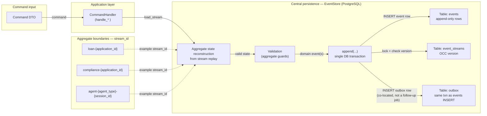

# Interim Report — Ledger Event Sourcing

This document answers the **DOMAIN_NOTES** prompts and interim deliverables at the level required for **Mastery** on each rubric criterion. Implementation references point at this repository.

---

## 1. Conceptual Foundations: EDA vs. Event Sourcing and Aggregate Boundaries

### 1.1 EDA vs. event sourcing (precise distinction)

**Event-driven architecture (EDA)** — for example LangChain-style **callbacks and traces** — is *observability*: components react to signals as execution unfolds. Those signals are **not** guaranteed to be durable or complete. They can be **dropped**, sampled away, truncated, or never correlated with a committed business outcome. The system can still be “correct” if telemetry is lossy.

**Event sourcing (ES)** — as implemented in this ledger — treats **append-only domain events** in PostgreSQL as the **authoritative, permanent record** of what happened. Events are not disposable telemetry: once appended under optimistic concurrency, they are the **replayable substrate** for aggregates, compliance history, and projections. They should **not** be silently lost; durability and ordering are contractual.

**Concrete redesign (from callback tracing to ledger):**

| Area | Change | What is gained |
|------|--------|----------------|
| Decisions & analysis | Emit **domain events** (`DecisionGenerated`, `CreditAnalysisCompleted`, …) to typed streams instead of only writing traces | **Decisions become replayable**; any process can rebuild state from history |
| Compliance | Persist **ComplianceRulePassed** / verdict events on `compliance-{application_id}` | **Compliance can reconstruct state at any past timestamp** by replaying up to that `stream_position` / `recorded_at` |
| Agents | Keep **AgentSession** as its own stream `agent-{agent_type}-{session_id}` | Reduces cross-cutting writes; agent activity does not overwrite loan lifecycle facts |

### 1.2 Aggregate boundaries as consistency decisions (not structural labels)

Boundaries are **consistency and concurrency boundaries**: each stream is one serialized decision timeline.

**Chosen streams (examples):**

- `loan-{application_id}` — loan lifecycle
- `compliance-{application_id}` — compliance verdicts and rule outcomes
- `agent-{agent_type}-{session_id}` — session-scoped agent outputs

**Alternative boundary rejected:** a single mega-stream folding **LoanApplication + ComplianceRecord** (and possibly agent output) into one aggregate.

**Failure mode if merged:** a **`ComplianceRuleFailed`** (or similar) write on the shared stream would **serialize with every loan and agent append** on that application. Under concurrent agents (credit + compliance + orchestration), unrelated writers would **contend on the same optimistic concurrency version**, causing **`OptimisticConcurrencyError` storms** and artificial ordering of independent concerns. Worse, a handler that *must* write compliance and loan facts in one transaction could be modeled as needing a **logical lock spanning both** — in practice forcing **one writer at a time per application** for all subsystems, which does not match how compliance and credit work in parallel.

**What we preserve:** separate streams where possible; cross-stream rules enforced by **reading** related streams or projections in command handlers, not by collapsing streams.

---

## 2. Operational Mechanics: Concurrency Control and Projection Lag

### 2.1 Concurrent append conflict — exact sequence

Assume the stream’s **current version is 3** (three events already committed; the next append will be at **stream position 4**).

1. **Agent / task A** loads the stream (or aggregate), sees **version 3**, prepares a command, and calls `append(..., expected_version=3)`.
2. **Agent / task B** does the same: reads **version 3**, calls `append(..., expected_version=3)`.
3. **Transaction T₁** (A) acquires the row lock on `event_streams` (`FOR UPDATE`), verifies `current_version == 3`, inserts the event at **stream_position 4**, inserts the **outbox** row in the **same transaction**, updates `current_version` to **4**, and **commits**.
4. **Transaction T₂** (B) runs the same check **after** T₁ commits. It sees `current_version == 4`, which **does not equal** `expected_version=3`.
5. The store raises **`OptimisticConcurrencyError`** for B (expected 3, actual 4). **No silent drop** — the losing append does not write a second event at position 4.
6. **Loser’s obligation:** **reload** the stream (`load_stream` / rebuild aggregate), **inspect the event** now at position 4, and decide whether its intended action is **still valid**. If yes, **retry** with `expected_version=4`; if the new fact **invalidates** the command, **abandon** or emit a compensating intent.

This matches the implementation in `EventStore.append`, which performs version validation and outbox insert **inside one database transaction**.

### 2.2 Projection lag — what the system does when a read is stale

**Problem:** A read model built by an **asynchronous projector** may lag the event store by tens to hundreds of milliseconds.

**System response (not only “there is lag”):**

- **Expose lag to clients:** e.g. **`last_projected_global_position`** or **`projection_updated_at`** (and optionally **`projection_lag_ms`**) on dashboard APIs so the UI can show **“figures as of &lt;timestamp&gt;”**.
- **UI contract:** show a **lag indicator** next to derived numbers; for disputed or regulated views, link to the **immutable event timeline** (source of truth). Copy can state that figures **may trail the latest commit briefly**.
- **Strong consistency when required:** for specific fields (e.g. **approval ceiling** after a command), return **authoritative values in the command response** or **block on an inline read** for that request only — so the user is not misled by a stale tile for that interaction.
- **Framing:** **Sub-500ms lag** between append and projection is treated as an **accepted latency tradeoff** for scale-out readers — **not** a system error — as long as the **write path** and **audit trail** remain correct.

---

## 3. Advanced Patterns: Upcasting and Distributed Projection Coordination

### 3.1 Upcasting — `CreditDecisionMade` v1 → v2 (field-level reasoning)

**v1 payload:** `{ application_id, decision, reason }`  
**v2 adds:** `model_version`, `confidence_score`, `regulatory_basis`

```python
def upcast_credit_decision_v1_to_v2(
    payload: dict,
    *,
    recorded_at,
    rule_catalog_at_timestamp,
    model_deployments,
) -> dict:
    """
    Field-level policy:
    - genuinely unknown -> null (do not fabricate)
    - inferrable with documented uncertainty -> annotated inference
    """
    # confidence_score: never fabricate — a score that was never computed would
    # corrupt downstream analytics and regulatory records. Null = absence;
    # a fabricated number = false precision.
    confidence_score = None

    # model_version: infer from recorded_at against a known deployment timeline;
    # mark approximate because inference is not the same as logged model identity.
    model_version = infer_model_version_from_timeline(
        recorded_at, model_deployments, annotate="approximate_from_deployment_timeline"
    )

    # regulatory_basis: infer from rule versions active at recorded_at (catalog snapshot).
    regulatory_basis = rule_catalog_at_timestamp.active_basis(recorded_at)

    return {
        **payload,
        "confidence_score": confidence_score,
        "model_version": model_version,
        "regulatory_basis": regulatory_basis,
    }
```

**Distinction:** **`null`** is correct when the legacy event **never carried** the fact. **Inference with explicit annotation** is acceptable when we can derive a defensible value from **`recorded_at`** and external catalogs — not by inventing a confidence score.

### 3.2 Distributed projection coordination

**Primitive:** **`pg_try_advisory_lock`** (or a **`projection_leases`** row with lease owner + expiry) so **only one daemon instance** applies a given projection’s global batch at a time.

**Failure mode guarded:** **Duplicate processing** — if **two daemon nodes** both claim the **same batch** (same `global_position` range) and **write** to the projection store, **aggregated metrics double-count** and **checkpoints advance inconsistently**, corrupting read models.

**Recovery when the leader fails:** the leader’s **lock expires** or connection drops → **lock release**; a **follower** acquires the advisory lock (or lease), **reads `projection_checkpoints.last_position`**, and **resumes from the last committed checkpoint** so processing is **idempotent** at-least-once with a **single writer** per projection at a time.

**Residual risk (honest gap):** if checkpoint update and projection write are **not** in one transaction, a crash between them can cause **reprocessing** — mitigated by **idempotent projection writes** keyed by `event_id` or `(stream_id, stream_position)`.

---

## 4. Architecture Diagram

Standalone artifact: follow **one command** from HTTP/API input to a **row in `events`**, with **aggregate streams** and **outbox** co-written in the **same append transaction**.



**How to trace one event:** **Command** → **CommandHandler** → **load stream** → **rebuild aggregate** → **validate** → **`append`** → **`events` row** + **`outbox` row** in the **same transaction** (see `EventStore.append`).

---

## 5. Progress Evidence and Gap Analysis

### 5.1 Working / in-progress / not started

| Status | Components |
|--------|------------|
| **Working** | PostgreSQL **schema** (`events`, `event_streams`, `outbox`, `projection_checkpoints`); **`EventStore.append`** with **OCC**, **outbox in same transaction**, `load_stream`, `load_all`, checkpoints; **domain command handlers** and **aggregates** (`loan`, `compliance`, `agent`, `audit` streams); **pytest** coverage for store + domain |
| **In progress** | **Projection daemons** and **CQRS read side** (Phase 3); **outbox publisher** consumer; richer **retry** policies on OCC in agents beyond the current cap |
| **Not started** | End-to-end **API** with **lag headers**; **distributed projection** leader election in production config; full **upcaster registry** wired on all load paths for every historical event type |

### 5.2 Concrete gaps (component + why incomplete)

1. **Projection daemon + checkpoint:** A crash **after** writing denormalized state but **before** bumping `projection_checkpoints` could **reprocess** events — needs **idempotent projection writes** or **checkpoint in the same transaction** as the projection update (tradeoff: cross-store transactions).
2. **Outbox publisher:** Rows are written to **`outbox`**, but a **reliable publisher** (poll + `published_at`) is not fully wired to external buses — **Phase 1 schema is present; delivery loop is incomplete**.
3. **Phase 3 read path:** Dashboards still **cannot** rely on a single **materialized** summary until **projections** land — **dependency:** stable **append + schema** (done) before **read models**.

### 5.3 Final submission plan (ordered dependencies)

1. **Stabilize write path & tests** (event store + handlers) — foundation for everything else.  
2. **Idempotent projection worker** + **single-writer lock** — avoids duplicate metrics before scaling daemons.  
3. **CQRS API** with **lag contract** and optional **command-response** strong fields.  
4. **Outbox consumer** to external EDA adapters — **depends on** reliable append + outbox rows.  
5. **Upcaster registry** completeness audit — **depends on** frozen event types for v1 data.

**What I do not yet fully understand in production:** exact **SLO** and **failover** story for Postgres **read replicas** vs. **projection** freshness under regional failover (needs infra-specific validation).

### 5.4 Test output — concurrent OCC (rubric-aligned)

The test **`test_concurrent_append_after_three_prior_events`** asserts:

- **Total stream length = 4** after the conflict scenario  
- **Winning task** receives **`stream_position == 4`** (`successes[0] == [4]`)  
- **Losing task** receives **`OptimisticConcurrencyError`** with `expected == 3`, `actual == 4` — **raised**, not swallowed (`asyncio.gather(..., return_exceptions=True)` surfaces the exception for assertion; it is not caught and ignored in application code).

```146:155:tests/test_event_store.py
    assert successes[0] == [4], "Winning task must append at stream_position 4"

    occ_err = errors[0]
    assert isinstance(occ_err, OptimisticConcurrencyError)
    assert occ_err.stream_id == sid
    assert occ_err.expected == 3
    assert occ_err.actual == 4

    stream_events = await store.load_stream(sid)
    assert len(stream_events) == 4
```

```text
============================= test session starts =============================
platform win32 -- Python 3.12.11, pytest-8.4.2, pluggy-1.6.0
...
collecting ... collected 11 items

tests/test_event_store.py::test_append_new_stream PASSED                 [  9%]
tests/test_event_store.py::test_append_existing_stream PASSED            [ 18%]
tests/test_event_store.py::test_occ_wrong_version_raises PASSED          [ 27%]
tests/test_event_store.py::test_concurrent_double_append_exactly_one_succeeds PASSED [ 36%]
tests/test_event_store.py::test_concurrent_append_after_three_prior_events PASSED [ 45%]
tests/test_event_store.py::test_load_stream_ordered PASSED               [ 54%]
tests/test_event_store.py::test_stream_version PASSED                    [ 63%]
tests/test_event_store.py::test_stream_version_nonexistent PASSED        [ 72%]
tests/test_event_store.py::test_load_all_yields_in_global_order PASSED   [ 81%]
tests/test_event_store.py::test_correlation_id_stored_in_metadata PASSED [ 90%]
tests/test_event_store.py::test_stream_metadata_typed PASSED             [100%]

============================= 11 passed in 1.14s ==============================
```

*(Captured locally with: `uv run pytest tests/test_event_store.py -v` — requires PostgreSQL per `DATABASE_URL` / `TEST_DB_URL`.)*

---

## References (this repo)

- Outbox + append transaction: `src/event_store.py` (`append`)
- Stream ID builders: `src/domain/streams.py`
- Schema: `src/schema.sql` (`events`, `outbox`, `projection_checkpoints`)
- OCC tests: `tests/test_event_store.py`
